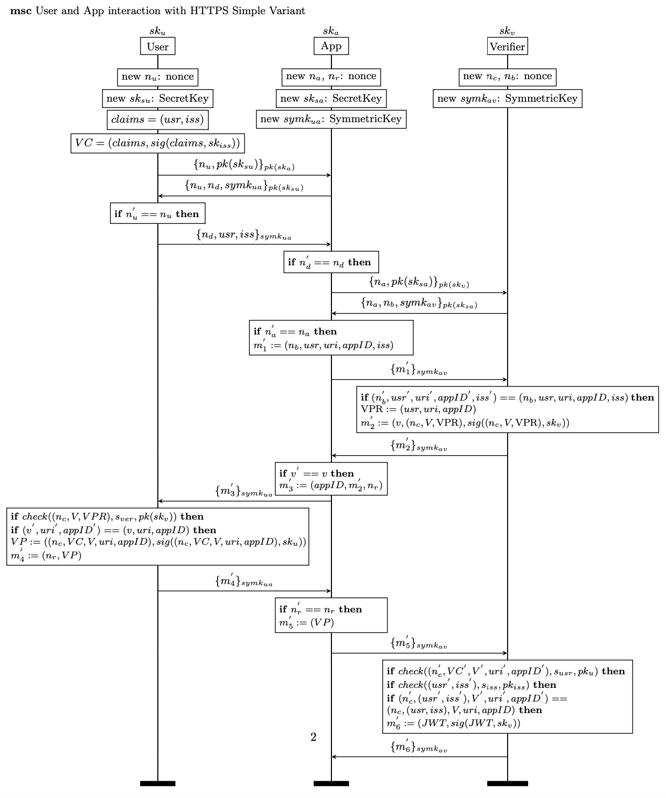
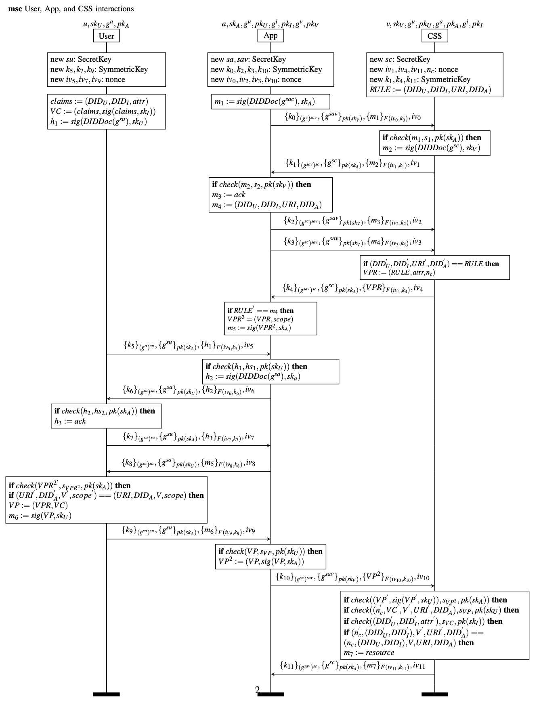

## VC-Based Solid Authentication Protocol with separation between Apps and Users

The VC-Based Solid Authentication Protocol with separation between Apps and User: The issuance of the VC is done following traditional SSI protocol where users directly contact issuer for asking new credentials. The verification is slightly different since we put an application in the authentication loop in order to "delegate" the access. 
It is possible to implement the protocol through two different approaches which differs on the basis of security used. In the first proposal we used HTTPS, while in the second one we leveraged DIDComm. We present both in the following sections.
### HTTPS
This version consider HTTPS handshake referring to the nonce as $n_u, n_a$, the others nonces are used to guarantee protection against MITM attacks. 
It is possible to check the output of our protocol [here](log/log.txt)


#### Result

| Property  | Holds | Note |
| ------------- | ------------- | ------------- |
| Secret rule_fromVerifier | Yes  | The Verifiable Presentation Request sent from the Verifier remains secret, cannot be produced if the user is not the real user. |
| Secret vp_fromProver | Yes  | The Verifiable Presentation sent by the Prover (User) remains secret. |
| Secret access_token_fromVerifier | Yes  | The token given to the App to access resources remains secret. |
| Authentication Verifier  | Yes  | The app is able to authenticate the verifier. |
| Authentication App  | Yes  | The verifier is able to authenticate the app. |
| Authentication User  | Yes  | The app is able to authenticate the user. |
### DIDComm
The greatest difference with respect to HTTPS is that in this version we do not use encryption of the entire packet since we leverage the in-line encryption of the protocol presented in [[https://identity.foundation/didcomm-messaging/spec/ | DIDComm Spec v.2 ]]. In particular, the content of the message is encrypted using XChaCha20Poly1305 with a 256 bit key (XC20P), which guarantee anonymity and encryption; while the symmetric key is wrapped according to ECDH-ES+A256KW. The information about the symmetric key used ($k_i$) for the encryption are contained in the first part of the message, while $iv_i$ is sent in plaintext.
To authenticate the party and to establish a session key, the session public key to be used to encrypt the new messages is encrypted using the long-live public key of the other party (CSS), as shown in the message $\{g^{sav}\}_{pk(sk_v)}$. Similarly, the other party (CSS) encrypt the session public key using the long-live public key of the App. Both leverages the Diffie-Hellman Key Agreement according to ECDH-ES+A256KW.



To model the modular exponentiation, we leveraged Diffie-Hellman key. A principal $A$ (App) chooses a random exponent $a \in Z_q^*$ , and sends $g^a$ to $B$ (CSS). Similarly, B chooses a random exponent $b \in Z_q^*$, and sends $g^b$ to $A$. Then $A$ computes $(g^b)^a$ and $B$ computes $(g^a)^b$ . These two keys are equal, since $(g^b)^a =(g^a)^b$ , and cannot be obtained by a passive attacker who has $g^a$ and $g^b$ but neither $a$ nor $b$. It is possible to model it into ProVerif as follow:
```ProVerif
type G.
type exponent.
const g: G[data].
fun exp(G, exponent): G.

equation forall x:exponent, y:exponent; exp(exp(g, x), y) = exp(exp(g, y), x).
```

# Forward Secrecy
[[https://identity.foundation/didcomm-messaging/spec/ | DIDComm Spec v.2 ]] does not provide any information about forward secrecy([[https://didcomm.org/book/v2/pfs | Ref. DIDComm Guidebook]]) since the choose of keys is up to the parties. For this reason we implemented a particular mechanism to guarantee the forward secrecy. 
# Non-Repudiation
The property of non-repudiation can be divided into two different aspect. There are two non-repudiation perspectives: the non-repudiation of authentication, and the non-repudiation of resource requested.
## Non-repudiation of authentication (App -> User, not reversing)
The non-repudiation of authentication can be potentially achieved by the proposed protocol because whenever an App request for a signature by the user (VPR), then the App signs this request, making for the user possible to assess that App <b>REQUESTED</b> access to that precise resource in a precise time. Anyway, despite it is possible for the User that App requested for the resource, the App cannot assess that User give access to the resource. <i>It might be possible that App generates a VPR, and the User do not respond with a signed VP, makes the protocol unfair because the User can assess that he generated the VP, when actually didn't sent it to the app.</i>  

Anyway, we suppose that App trust the User, so it is not interested in assessing if the user give access to a resource or not because it is in the interest of the App to behave in a genuine way. What is much more interesting is the non repudiation of resource requested by the App. It might be possible that App generates Wrapped VPR but then the CSS does not deliver the resource, or the CSS delivers resource without any claims about the App.

This aspect is what we want to solve by leveraging the interaction with the CSS. Namely, the App will generate the proof of requesting a resource (NRO) only once it has enough guarantee about the resource requested (NRR) from the CSS.  
## Non-repudiation of resource requested and delivered (Between App and CSS)
Differently from non repudiation of authentication, the non-repudiation of resource requested cannot be easily achieved by this protocol. In fact, despite the CSS can potentially provide a signature over the VPR generated, then it is not possible to assess if that specific resource has been delivered by the CSS in a non-malicious way. This means that it is possible that App asks for a resource and generates the Wrapped VPR, but then the CSS do not deliver the resource, or deliver a wrong resource. 
### Non-Repudiable DIDComm
The idea of non-repudiation is that the content of message $m_7$ rather than containing the resource, as in the previous protocol, it will contains an encrypted version of the resource. The encryption is produced using the symmetric key obtained by the DIDComm Handshake between TTP and CSS. So in this new version we introduce a new participant to the protocol; which is the TTP. Similarly to the other case, the TTP is identified by a pair $(g^{TTP}, PK_{TTP})$, which is managed through a DIDDocument and known to all the participants.

